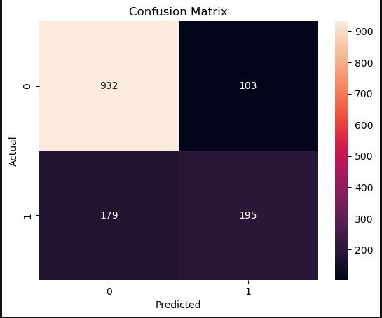

---

## Customer Churn Prediction using Random Forest

## Project Overview

Customer churn prediction is an important problem for subscription-based businesses.
This project builds a machine learning model to predict whether a customer is likely to leave a telecom service based on demographic information, service usage, and billing details.

The model is trained using the **Telco Customer Churn Dataset** and implemented using Python and Scikit-learn.

---

## Dataset

Dataset used: **Telco Customer Churn Dataset**

The dataset contains **7043 customer records** with information about:

* Customer demographics
* Account information
* Services subscribed
* Billing information
* Churn status (target variable)

Target variable:

Churn

* Yes → Customer left the service
* No → Customer stayed

---

## Machine Learning Pipeline

The project follows a standard machine learning workflow:

### 1. Data Exploration

* Dataset inspection using Pandas
* Checking missing values
* Understanding class imbalance

### 2. Data Cleaning

* Converted `TotalCharges` to numeric
* Filled missing values using median
* Removed unnecessary column `customerID`

### 3. Feature Engineering

* Converted categorical variables using one-hot encoding
* Converted target variable (`Churn`) to binary format

### 4. Model Training

Model used:

Random Forest Classifier

Hyperparameters used:

* n_estimators = 300
* max_depth = 10
* min_samples_split = 5
* random_state = 42

### 5. Model Evaluation

Evaluation metrics used:

* Accuracy
* Precision
* Recall
* F1 Score
* Confusion Matrix

---

## Model Performance

Example evaluation metrics:

Accuracy: ~0.79

Classification Report includes:

* Precision
* Recall
* F1 Score

Confusion matrix visualization is included in the notebook.

---

## Feature Importance

The Random Forest model provides feature importance scores to identify which features contribute most to churn prediction.

Important features typically include:

* Contract type
* Tenure
* Monthly charges
* Internet service
* Tech support

These insights can help businesses understand why customers leave.

---

## Technologies Used

* Python
* Pandas
* NumPy
* Matplotlib
* Seaborn
* Scikit-learn
* Joblib

---

## Future Improvements

* Hyperparameter tuning using GridSearchCV
* Compare multiple models (Logistic Regression, XGBoost)
* Deploy the model using a web API
* Build a churn prediction dashboard

---

## Author

Aniket Patil

This project is part of my journey transitioning into an Applied AI Engineer role.
